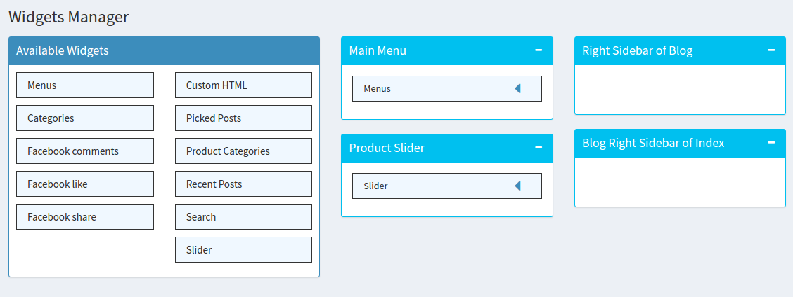

# General Updates and Fix
* Convert display_price() to use toLocaleString
### Backend:
* Fix tables in product backend menu, edit tableStructure of product category table
* Error: upload images while creating a new product -> uploading image changes the photo name

* Change table column names with values in language files -> create module product section in language files
```js
    /** Module product */
    "m_product_backend_render_create": "Create New Product",
    "m_product_backend_render_update": "Edit & Update Product",
    "m_product_backend_flash_create_success": "Product created successfully",
    "m_product_backend_flash_delete_success": "Product deleted successfully",
    "m_product_backend_flash_update_success": "Product updated successfully",
    "m_product_backend_flash_update_error": "Product updated unsuccessfully",
    // create new product form 
    "m_product_backend_views_form_content": "Product Detail Description",
    "m_product_backend_views_form_short_desc": "Short Description",
    "m_product_backend_views_form_image": "Product Image",
    "m_product_backend_views_form_popup_choose_image": "Choose product image",
    "m_product_backend_views_form_product_status": "Product Status",
    "m_product_backend_views_form_product_status_option_old": "old",
    "m_product_backend_views_form_product_status_option_new": "new",
    "m_product_backend_views_form_category": "Category",
    "m_product_backend_views_form_category_placeholder": "Select Category",
    "m_product_backend_views_form_image_placeholder": "Click here to select a file",
    // order status in order list
    "m_product_backend_views_order_status": "Order Status",
    "m_product_backend_views_order_status_option_completed": "Completed",
    "m_product_backend_views_order_status_option_shipping": "Shipping",
    "m_product_backend_views_order_status_option_pending": "Pending",
    // module title
    "m_product_backend_module_title": "Product",
    "m_product_backend_module_desc": "Product Manager",
    // display in backend main right side navigation menu
    "m_product_backend_module_menu_backend_menu_title": "Product",
    "m_product_backend_module_menu_backend_menu_index": "Product List",
    "m_product_backend_module_menu_backend_menu_category_index": "Category List",
    "m_product_backend_module_menu_backend_menu_order_index": "Order List",

```


* Routes in a feature: `/admin/:feature/:action` e.g. `/admin/products/categories`
* The part `/admin/:feature` is fixed,  `:feature` is read from feature folder name. We can only change the part after `/admin/:feature` in route.js and feature.js of that feature

```js
```

* `products/detail/:productId` encounters a bug: 'column user.user_login does not exits'. Table "arr_user" do not have column user_login

#### feature.js: 
* Permission shows what actions can be performed in this feature and their corresponding permission

```js
// features/products/feature.js
    permissions: [
        {
            name : 'index',
            title : 'View All product'
        },
        {
            name : 'create',
            title : 'Create products'
        },
```
* In route.js, each route request may have permission check, for example, only user with "create" persmission can create a new product
```js
// features/products/backend/route.js
        "/products/create": {
            get: {
                handler: comp.productCreate,
                authenticate: true,
                permissions: "create"
            },
            post: {
                handler: comp.productSave,
                authenticate: true,
                permissions: "create"
            }
        },
```
* Also, in feature.js, you can specify sub menu of products to be shown in backend men.
* With the backend_menu below, under products backend menu, you will have 3 sub menus:
  * Product List -> Permission 'index' -> Access Route: 'admin/products' 
  * Category List -> Permission 'category_index' -> Access Route: 'admin/products/categories' 
  * Order List -> Permission 'order_index' -> Access Route: 'admin/product/order' 
```js
// features/products/feature.js
    backend_menu: {
        title: __('m_product_backend_module_menu_backend_menu_title'),
        icon: 'fa fa-newspaper-o',
        menus: [
            {
                permission : 'index',
                title: __('m_product_backend_module_menu_backend_menu_index'),// the displayed content is in lang/en_US.js or vi_VN.js
                link: '/'
            },
            {
                permission : 'category_index',
                title: __('m_product_backend_module_menu_backend_menu_category_index'),
                link : '/categories'
            },
            {
                permission : 'order',
                title: __('m_product_backend_module_menu_backend_menu_order_index'),
                link : '/order'
            }
        ]
    },
```

* Also, you may want to add products or product categories to menu in front end
* With add_link_menu, you can access product category and products when creating a new menu in menu feature.
```js
// features/products/feature.js
    add_link_menu : {
        category_product : {
            title : 'Product Category',
            route : '/products/category/link/menu',
            //list : '/products/{id}', // link to display all pages
            search : true
        },
        products : {
            title : 'Link Products',
            route : '/products/link/menu',
            list : '/products', // link to display all pages
            search : true
        }
    }
```

## BUGS: 
#### Cannot upload images to server when creating new products 
* ERROR: cannot rename uploaded images 
* SOLUTION: do not convert image absolute path to lower case
```js
// in features/products/backend/controller/product.js
controller.productUploadImage = function (req, res) { 
    // remove toLowerCase() from paths
    // old: newPath = newPath.replace(/ /g,'_').toLowerCase();
    newPath = newPath.replace(/ /g,'_');
    // old: res.send('/img/products/'+files.image.name.replace(/ /g,'_').toLowerCase());
    res.send('/img/products/'+files.image.name.replace(/ /g,'_');
}
```
#### Cannot upload images to server when creating blog posts 
* ERROR: EXDEV: cross-device link not permitted -> fs.rename error (happens with linux distro)
* SOLUTION: use 'fs-extra' module -> 
```js
// in features/upload/backend/controllers/index.js
// use fs-extra module that is already included in arrowjs
const fsExtra = require('arrowjs').fs; 
// fsExtra.move will attempts to perform fs.rename() first, if fails, it then tries fs.copy + fs.unlink before failing
controller.upload = function (req, res) {
  // change all fs.rename(...) to fsExtra.move(...)
   fsExtra.move(files["files[]"].path, result, function (err) {
      if (err) logger.error(err);
   });
}
```

### Blog archive routes: 
* ERROR: SQL query in controller.listArchive is wrong
```js
// features/blog/frontend/route.js
    controller.listArchive = function (req, res) {
        let month_ = req.params.month || '01';
        let year_ = req.params.year || '2000';
        let page = req.params.page || 1;

        let number_item = app.getConfig('pagination').frontNumberItem || 10;

        let sql = 'select posts.*,users.user_email,users.user_url,users.display_name,' +
            'users.user_image_url,users.user_status' +
            'from arr_post as posts left outer join arr_user as users on posts.created_by = users.id WHERE' +
            ' "posts"."type" = \'post\' AND "posts"."published" = 1 AND EXTRACT(MONTH FROM posts.created_at ) = ' + month_ + ' AND EXTRACT(YEAR FROM posts.created_at) = ' + year_ +
            ' ORDER BY posts.id ASC OFFSET ' + (page - 1) * number_item + ' LIMIT ' + number_item;

        let sqlCount = 'select count(*) ' +
            'from arr_post as posts WHERE' +
            ' "posts"."type" = \'post\' AND "posts"."published" = 1 AND EXTRACT(MONTH FROM posts.created_at ) = ' + month_ + ' AND EXTRACT(YEAR FROM posts.created_at) = ' + year_;

        app.models.rawQuery(sql).then(function (result) {
            if (result) {
                // Render view
                app.models.rawQuery(sqlCount)
                    .then(function (countPost) {
                        let totalPage = Math.ceil(countPost[0][0].count / number_item) || 1;

                        res.frontend.render('archives', {
                            posts: result[0],
                            archives_date: year_ + ' ' + month_,
                            month: month_,
                            totalPage: totalPage,
                            currentPage: page,
                            baseURL: '/blog/posts/archives/' + year_ + '/' + month_ + '/page-{page}'
                        });
                    })
```
    
* SOLUTION: we need to change sql and sqlCount
    * In sql, users.user_url does not exist. There is no such column in our table. Also, change all 'created_at' to 'published_at'
    * In sqlCount, change all 'created_at' to 'published_at'

    ```sql

        let sql = "select posts.*, users.user_email, users.display_name, users.user_image_url, users.user_status" + 
        " from arr_post as posts left outer join arr_user as users on posts.created_by = users.id" + 
        " WHERE posts.type = 'post' AND posts.published = 1 AND EXTRACT(MONTH FROM posts.published_at) = "+ month_  + 
            " AND EXTRACT(YEAR FROM posts.published_at) = " + year_ + "ORDER BY posts.id DESC OFFSET " + (page - 1) * number_item + " LIMIT " + number_item;

        let sqlCount = "select count(*)" +
            " from arr_post as posts WHERE" +
            " posts.type = 'post' AND posts.published = 1 AND EXTRACT (MONTH FROM posts.published_at ) = " + month_ + 
            " AND EXTRACT (YEAR FROM posts.published_at) = " + year_;
    ```

    * Change render file to 'posts' and baseURL as below

    ```js
        res.frontend.render('posts', {
            posts: result[0],
            archives_date: year_ + ' ' + month_,
            month: month_,
            totalPage: totalPage,
            currentPage: page,
            baseURL: '/blog/posts/archives/' + year_ + '/' + month_ + '/page-'
        });
    ```

# Convert Thanhquanmobile to ArrowCMS Mobileshop

## Create Mobileshop theme in themes/frontend
* Create a new folder themes/frontend/Mobileshop
* Inside folder Mobileshop/: create a theme structure as follow
1. Each theme must have a theme.json and screenshot.png so that backend system can recognise the theme
2. Move files in public/ of thanhquan to Mobileshop/assets/
3. Move html files to arrowcms
4. Must change all links to images and routes
5. 
6. Phones and accessories are in products
```js
 '/products/phone'
 '/products/accessory'
 '/products/manufacturer/:manufacturerName'
 '/products/detail/'

```
## Theme.json:
* In theme.json, we can specify different sidebars, with the sidebars below, in admin page, this theme will have four areas to hold widgets
```js
  "sidebars": [
    {
      "name": "main-menu",
      "title": "Main Menu"
    },
    {
      "name": "slider",
      "title": "Slider"
    },
    {
      "name": "left-sidebar",
      "title": "Left Sidebar of Product"
    },
    {
      "name": "right-sidebar",
      "title": "Right Sidebar of Blog"
    },
    {
      "name": "blog-sidebar",
      "title": "Blog Right Sidebar of Index"
    }
  ],
```
* You can see in the screenshot below, there are four sidebards in widgets admin menu



## Mobileshop/Layouts include
* File html from thanhquanmobile -> file in Mobileshop
* index.html -> _layout.twig (remove the content inside  and move to index.twig in Mobileshop/features/dashboard)
* head.html -> _head.twig
* header.html -> _header.twig
* footer.html -> _footer.twig
* contact-footer.html -> _contact-footer.html
* login-form.html -> _login-form.html

## Mobileshop/features/

#### Convert frontend theme
* Mobileshop/features/dashboard/index.twig extends from _layout.twig
* In index.twig, the banner slider is moved to Mobileshop/widgets/slider/banner-slider.twig 
* Cut the below part of code to banner-slider.twig 
```html
<!--BANNER SLIDER-->
<div id="carousel-example-generic" class="carousel1 slide" data-ride="carousel">
  <div class="carousel-inner">
    <div class="item active">
      <a href=""></a>
    </div>
    <div class="item">
      <a href=""></a>
    </div>
    <div class="item">
      <a href=""></a>
    </div>
  </div>
</div>
<!--END BANNER SLIDER-->
```
* The blog sidebar is moved to Mobileshop/widgets/recent_posts/blog-sidebar.twig
* Cut the below part to blog-sidebar.twig
```html
<!--SIDE BAR BLOG-->
<a class="" href="/bai-viet">
	
	<p>iPhone 6 32GB chính thức lên kệ tại TQSP</p>
  <span>28/03/2017</span>
</a>
<a class="" href="/bai-viet">
	
	<p>Xiaomi Redmi Note 4 bản đen nhám sang trọng như iPhone 7 sẽ lên kệ tại TQSP</p>
	<span>27/03/2017</span>
</a>
<a class="" href="/bai-viet">
	
	<p>Thời điểm ra mắt flagship Nokia 8 chip Snapdaron 835, RAM 6 GB, camera 24 MP</p>
	<span>26/03/2017</span>
	</a>
<a class="more" href="/tin-tuc">Đọc thêm</a>
<!--END SIDE BAR BLOG-->
```
* So we can add them as a widgets (Choosing widgets to use is backend functionality)
* Now in index.twig, instead of the code above, we use getSidebar('sidebar_name') to display the widget in frontend
```html
<!--in index.twig-->
      <div class="col-md-9 no-padding">
         <!--BANNER SLIDER-->
         {{ getSidebar("slider") | async | safe }}
        <!--END BANNER SLIDER-->
      </div>
      
      <!--make this one a side bar blog-->
      <div class="col-md-3 news-box ">
        <!--SIDE BAR BLOG-->
         {{ getSidebar("blog-sidebar") | async | safe }}
        <!--END SIDE BAR BLOG-->
      </div>
```
* The input of getSidebar() is the name of side bar that is defined in theme.json and the title of the side bar is displayed in widget 
[img!](readme-img/widget2.png)

* You can also see in the image above that we drag the slider and recent posts widgets to slider and blog-sidebar (remember I'm referring to the name of the sidebar defined in theme.json, not the displayed title in the widget image above). 
* The name of the widget (the widget folder name) refers to the logic and data that will be handled by this widget, for example, recent_posts will retrieve recently published blog posts (we can also specify the number of posts we want to retrieve). Whereas, the sidebars defined in theme.json helps us to create places (like placeholder areas) where we want to put the widget in. For example, we have blog-sidebar (which is the blog side bar in index page) and right-sidebar (which is the blog right side bar in blog page - '/blog/posts' and '/blog/posts/:postid')
* Next, we can choose the layout to use for each widget (the layout here is the html template we want to use). Each widget has its own controller (taking care of retrieving data from database and render the widget layout) and default layout. For example, in widgets/slider/, we have controllers/index.js and default layout in views/default.twig
[!img](readme-img/widgets-folder.png)
* In each theme, we can add more layouts for widgets that we want to use. For example, in themes/frontend/Mobileshop, we also have widgets folder. 
* widgets/recent_posts/blog-sidebar.twig now holds the blog side bar content that we cut from index.twig previously and similarly, widgets/slider/banner-slider.twig now holds the banner slider. 
[!img](readme-img/mobileshop-widgets.png)

* At the moment, the content of blog-sidebar.twig and banner-slider.twig are still the hard coded content that we cut from index.twig. To display the actual blog posts that we have in database, we change blog-sidebar.twig as below 
[!img](readme-img/blog-sidebar.png)

* Now, let's create some posts to display it in the blog side bar. You log in to admin page at 'localhost:8000/admin'
* For example, create a blog post
 [!img](readme-img/create-post.png)
* However, we need to have blog pages ready to display blog posts and a detail post when clicking on the posts in frontend. Skip to Blog part below to see how to handle blog section, create posts.twig and post.twig in Mobile/features/blog
* Retrieve product data for product slider in homepage: in features/dashboard/frontend/controllers/index.js, change the controller.index to get products
```js
controller.index = function (req, res) {
        let slide_limit = 5
        promise.all(
            [
                // Find all product
                application.models.product.findAll({
                    limit: slide_limit,
                    order: 'id ASC'
                }),
                // Find all product
                application.models.product.findAll({
                    where: {
                        status: 1
                    },
                    limit: slide_limit,
                    order: 'id DESC'
                }),
                application.models.product.findAll({
                    where: {
                        status: 0
                    },
                    limit: slide_limit,
                    order: 'id DESC'
                })

            ]
        ).then(function (results) {
            if (results) {
                // Render view
                res.frontend.render('index', {
                    products: results[0],
                    olds: results[1],
                    news: results[2]
                });
            } else {
                // Redirect to 404 if post not exist
                res.frontend.render('_404');
            }
        }).catch(function (err) {
            console.log(err.stack),
                res.frontend.render('_404');
        });
    };
```
#### Changes images link in html and css files: 
* Move public/svg/ folder of thanhquanmobile to Mobileshop/assets/images/svg/ -> change all svg links in index-style.css

### Products: 
#### Product Category - filter left sidebar of thanhquan now use product category widget
* For widgets, the content displayed by the widgets are retrieved by controllers/index.js inside the widget folder, the data is not passed by the route handler in features

#### themes/Mobileshop/features/products/
* Change gio-hang.html -> cart.twig
* chi-tiet.html -> detail.twig
* danh-sach.html -> products.twig
* In these files, we have to change routes, all static links, js logic,

##### Fix and update cart.twig
* Change controller.add_cart in features/products/frontend/controllers/product.js
* Change req.session.cart to object -> update features/products/frontend/controllers/product.js all parts relating to req.session.cart
```js
  req.session.cart = { 'product_id_1': product_quantity_1,
                       'product_id_2': product_quantity_2};
```

* In cart.twig, update all functions as well 
* Now, the cart features work as follow
  * Can click buy button multiple times and the product quantity in the cart is increased accordingly
  * When in cart.twig, we can see all products in cart and their details. We can change quantity input button of each product, ajax request is used to send request to server and update req.session.cart

#### Change list-menu-box (the left side menu box in 'danh-sach.html') 
#### Product Detail:
* When click on a product -> show product detail -> change old route '/dienthoai/:product_id' to Arrow CMS route format 'products/detail/:id'

### Blog: create html files to display blog and blog post
* tin-tuc.html -> posts.twig
* bai-viet.html -> post.twig
* lien-he.html -> contact.twig 

#### Post.twig: display one detail blog post 
* Copy html from bai-viet.html
* Change extends 'index.html' to '_layout.' + getConfig('viewExtension')
* Change src of static files e.g. '/frontend/Mobileshop/assets/css/danh-sach-style.css'
* Change src of `<a>` that goes to another url e.g. '/tin-tuc' is changed to '/blog/posts'
* 
* The left side bar of post.twig is modified to display blog categories 
* Create a new folder Mobileshop/widgets/categories, inside this folder create blog-categories.twig
* Cut the html code below from post.twig to blog-categories.twig
```html
<aside class="col-md-offset-1 col-md-2 list-menu-box">
<!--.....-->
</aside>
```
* In blog-categories.twig, change the content from hard coded html to dynamic content as below
```html
<!--BLOG CATEGORIES-->

<aside class="col-md-offset-1 col-md-2 list-menu-box">
  <ul>
    <li class="menu-box"><span class="title-list the-loai-title">{{ widget.title | safe }}</span>
      <ul class="the-loai">
         
        <li><a href="/blog/posts/categories/{{ category.alias }}/{{ category.id }}">{{ category.name }}</a></li>
         
      </ul>
    </li>
  </ul>
</aside>

<!--END BLOG CATEGORIES-->
```
* And in post.twig and posts.twig, change the blog side bar with 
```html
<!--BLOG CATEGORIES-->
     {{ getSidebar("right-sidebar") | async | safe }}
<!--END BLOG CATEGORIES-->
```

* Next, Change the pagination part as below
```html
      <!-- Pagination Start -->
      
      <div class="pagination-box">
        <ul class="pagination">
           
          <li class="active"><a href="#">{{ i }}</a></li>
          
          <li><a href="/blog/posts/page/{{i}}"> {{i}} </a></li>
           
        </ul>
      </div>
      
```

* When rendering a detail post page or list posts by category, you may encounter error: SequelizeBaseError: column user.user_login does not exist. You need to remove 'user_login' in blog/frontend/controllers/post.js

* In post.twig, change the recommended posts at the bottom of the detail post page to recent_posts widgets
* Cut the recommended posts in post.twig to Mobileshop/widgets/recent_posts/recommended-posts.twig and change it as below
```html
<!--Mobileshop/widgets/recent_posts/recommended-posts.twig-->
<!--Recommended Posts -->
<div class="row mot-hang">
  <a href="/tin-tuc" class="big-title big-title2">TIN TỨC LIÊN QUAN</a>
  <span></span>

</div>
<div class="row">
   
  <div class="col-md-3">
    <a href="/blog/posts/{{post.id}}/{{post.alias}}"></a>
    <h4>{{ post.title }}</h4>
  </div>
  
</div>
<!-- End Recommended Posts -->
```
* In post.twig, we use getSidebar() to retrieve to recent_posts widget that is put in "bottom-posts" side bar 
```html
<!--Recommended Posts -->
   {{ getSidebar("bottom-posts") | async | safe }}
<!--End Recommended Posts -->
```
#### About widgets:
* In widgets/:widgetname/controllers/index.js, this file will sets up widget form in admin page (when we drag the widget to a side bar in admin menu, we will have a setting up form to select widget title, layouts, etc.)
  * 2 main functions: controller.settingWidget() 
    * Getting layouts 
    * Create setting form: use Arrow.Helper.WidgetForm
  * Render the widget in front end with controller.renderWidget()
    * we get data from the widget form in backend -> use the data for database query function to retrieve requested information
    * then pass the information and render the layout (the view file of the widget can be default.twig in widgets/:widgetName/views or the widget view of a particular theme in themes/frontend/:themeName/widgets/the-theme-widget-view.twig)

#### Create a blog_time_filter widget that will group blog posts by published month and then count number of posts by published month. As a result, the widget renders published months with number of posts in each month.
* Firstly, to register a new widget, we need to create widget.js in widget/blog_time_filter/

```js
'use strict';

module.exports = {
  title: "Blog filtered by published month",
  author: 'Techmaster',
  version: '0.1.0',
  description: "Display months that have published blog posts"
};
```

* Next create folder controllers and views in widgets/blog-time-filter  

```js
// widgets/controllers/index.js
'use strict';

module.exports = function (controller, component, application) {

  controller.settingWidget = function (widget) {
    // Get all widget layouts
    let layouts = component.getLayouts(widget.widget_name);

    // Create setting form
    let form = new ArrowHelper.WidgetForm(widget);
    form.addText('title', 'Title');
    form.addText('number_of_published_months', 'Number of Published Months');
    form.addCheckbox('display_published_months', 'Display');
    form.addSelect('layout', 'Layout', layouts);

    return new Promise(function (fullfill, reject) {
      fullfill(form.render());
    })
  };

  controller.renderWidget = function (widget) {
    // Get layouts
    let layout;
    try {
      layout = JSON.parse(widget.data).layout;
    } catch (err) {
      layout = component.getLayouts(widget.widget_name)[0];
    }
    console.log(widget);
    let limit = JSON.parse(widget.data).number_of_published_months || 5;

    // Get published_time
    if (JSON.parse(widget.data).display_published_months == 1) {
      // get published_months and their corresponding number of posts
      return application.feature.blog.actions.groupByPublishedMonth(limit)
        .then(function (published_time) {
        console.log(published_time);
        // published_time: each row consists of published_month, published_year & count
        // Render view with layout
        return component.render(layout, {
          widget: JSON.parse(widget.data),
          published_time: published_time
        })
      });
    }
  };
};

```
* Controllers/index.js uses `application.feature.blog.actions.groupByPublishedMonth(limit)` to get data from database
* `groupByPublishedMonth(limit)` is defined in features/blog/actions/post.js 
```js
// features/blog/actions/post.js 
    /**
     * Extract the months from published_at and counts posts in that month
     * @param limit {integer} - Limit number of months we retrieve
     */
    // Raw Query: select count(id), extract (MONTH from published_at) as published_month from arr_post group by published_month
    // Notes: we use raw query here so if the table name 'arr_post' is changed, we need to update this query
    // app.models refers to the sequelize instance - our database
    action.groupByPublishedMonth = function (limit) {
        return app.models.query("select count(id), extract(year from published_at) as published_year, extract(month from published_at) as published_month from arr_post where type = 'post' and published = 1 group by published_year, published_month order by published_year, published_month desc LIMIT ?",
        { replacements: [limit], type: sequelize.QueryTypes.SELECT });
    }
```

* In Mobileshop/widgets/, create a new folder `blog_time_filter` which holds files for Mobileshop/widgets/views
* Next, create blog-time-filter.twig

```html

<li class="menu-box">
  <span class="title-list thoi-gian-title">{{ widget.title | safe }}</span>
  <ul class="thoi-gian">
    
    <li><a href="/blog/posts/archives/{{item.published_year}}/{{item.published_month}}">Tháng {{item.published_month}}, {{item.published_year}} ({{item.count}})</a></li>
    
  </ul>
</li>

```
* Now, you have to add the new widget to Right side bar of blog (`admin/widgets/`), set number of published months you want to see, select layouts as below
[!img](readme-img/blog-time-filter-widget.png)

* It is displayed in front end as below. In my database, I only have total 6 blog posts over 4 months
[!img](readme-img/blog-time-filter-widget-frontend.png)

* After displaying filter in front end, we have handle routes of the filter, for example, clicking on 'Tháng 6, 2017 (3)' must show posts.twig with 3 blog posts from 'Tháng 6, 2017'
  * Check features/blog/frontend/route.js, we have archive routes, change the routes as below
  ```js
        // Archive router
        "/blog/posts/archives/:year([0-9]{4})/:month([0-9]{1}|[0-9]{2})(/)?": {
            get: {
                handler: controller.listArchive
            }
        },
        "/blog/posts/archives/:year([0-9]{4})/:month([0-9]{1}|[0-9]{2})/page-:page([0-9])(/)?": {
            get: {
                handler: controller.listArchive
            }
        },
  ```
  * In features/blog/frontend/controllers/post.js, update the controller.listArchive
  ```js
  controller.listArchive = function (req, res) {
        let month_ = req.params.month || '01';
        let year_ = req.params.year || '2000';
        let page = req.params.page || 1;

        let number_item = app.getConfig('pagination').frontNumberItem || 10;

        let sql = "select posts.*, users.user_email, users.display_name, users.user_image_url, users.user_status" + 
        " from arr_post as posts left outer join arr_user as users on posts.created_by = users.id" + 
        " WHERE posts.type = 'post' AND posts.published = 1 AND EXTRACT(MONTH FROM posts.published_at) = "+ month_  + 
            " AND EXTRACT(YEAR FROM posts.published_at) = " + year_ + "ORDER BY posts.id DESC OFFSET " + (page - 1) * number_item + " LIMIT " + number_item;

        let sqlCount = "select count(*)" +
            " from arr_post as posts WHERE" +
            " posts.type = 'post' AND posts.published = 1 AND EXTRACT (MONTH FROM posts.published_at ) = " + month_ + 
            " AND EXTRACT (YEAR FROM posts.published_at) = " + year_;

        app.models.rawQuery(sql).then(function (result) {
            if (result) {
                // Render view
                app.models.rawQuery(sqlCount)
                    .then(function (countPost) {
                        let totalPage = Math.ceil(countPost[0][0].count / number_item) || 1;

                        res.frontend.render('posts', {
                            posts: result[0],
                            archives_date: year_ + ' ' + month_,
                            month: month_,
                            totalPage: totalPage,
                            currentPage: page,
                            baseURL: '/blog/posts/archives/' + year_ + '/' + month_ + '/page-'
                        });
                    })
            } else {
                // Redirect to 404 if post not exist
                res.frontend.render('_404');
            }
        }).catch(function (err) {
            res.send("error");
            logger.error(err.stack);
        });
    };

  ```


